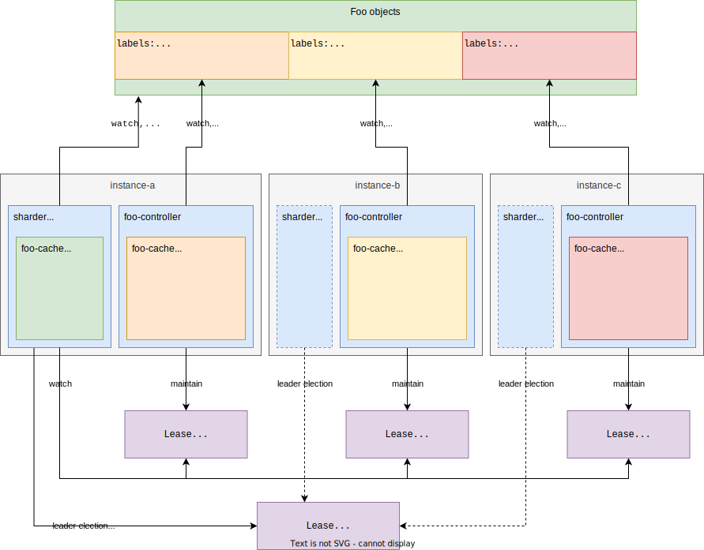

# Kubernetes Controller Sharding

_Towards Horizontally Scalable Kubernetes Controllers_

## About

This study project is part of my master's studies in Computer Science at the [DHBW Center for Advanced Studies](https://www.cas.dhbw.de/) (CAS).

You can download and read the full thesis belonging to this implementation here: [thesis-controller-sharding](https://github.com/timebertt/thesis-controller-sharding).
This repository contains the practical part of the thesis: a sample operator using the sharding implementation, a full monitoring setup, and some tools for demonstration and evaluation purposes.

The controller sharding implementation itself is done generically in [controller-runtime](https://github.com/kubernetes-sigs/controller-runtime).
It is currently located in the `sharding` branch of my fork: https://github.com/timebertt/controller-runtime/tree/sharding.

## TL;DR

Distribute reconciliation of Kubernetes objects across multiple controller instances.
Remove the limitation to have only one active replica (leader) per controller.

## Motivation

Typically, [Kubernetes controllers](https://kubernetes.io/docs/concepts/architecture/controller/) use a leader election mechanism to determine a *single* active controller instance (leader).
When deploying multiple instances of the same controller, there will only be one active instance at any given time, other instances will be on standby.
This is done to prevent controllers from performing uncoordinated and conflicting actions (reconciliations).

If the current leader goes down and loses leadership (e.g. network failure, rolling update) another instance takes over leadership and becomes the active instance.
Such a setup can be described as an "active-passive HA setup". It minimizes "controller downtime" and facilitates fast failovers.
However, it cannot be considered as "horizontal scaling" as work is not distributed among multiple instances.

This restriction imposes scalability limitations for Kubernetes controllers.
I.e., the rate of reconciliations, amount of objects, etc. is limited by the machine size that the active controller runs on and the network bandwidth it can use.
In contrast to usual stateless applications, one cannot increase the throughput of the system by adding more instances (scaling horizontally) but only by using bigger instances (scaling vertically).

This study project presents a design that allows distributing reconciliation of Kubernetes objects across multiple controller instances.
It applies proven sharding mechanisms used in distributed databases to Kubernetes controllers to overcome the restriction of having only one active replica per controller.
The sharding design is implemented in a generic way in my [fork](https://github.com/timebertt/controller-runtime/tree/sharding) of the Kubernetes [controller-runtime](https://github.com/kubernetes-sigs/controller-runtime) project.
The [webhosting-operator](#webhosting-operator) is implemented as an example operator that uses the sharding implementation for demonstration and evaluation.
These are the first steps toward horizontally scalable Kubernetes controllers.

## Sharding Design

High-level summary of the sharding design:

- multiple controller instances are deployed
- one controller instance is elected to be the sharder via the usual leader election
- all instances maintain individual shard leases for announcing themselves to the sharder (membership and failure detection)
- the sharder watches all objects (metadata-only) and the shard leases
- the sharder assigns individual objects to shards (using consistent hashing) by labeling them with the `shard` label
- the shards use a label selector to restrict the cache and controller to the set of objects assigned to them
- for moving objects (e.g. during rebalancing on scale-out), the sharder drains the object from the old shard by adding the `drain` label; after the shard has acknowledged the drain operation by removing both labels, the sharder assigns the object to the new shard
- when a shard releases its shard lease (voluntary disruption) the sharder assigns the objects to another active instance
- when a shard loses its shard lease the sharder acquires the shard lease (for ensuring the API server's reachability/functionality) and forcefully reassigns the objects

Read chapter 4 of the full [thesis](https://github.com/timebertt/thesis-controller-sharding) for a detailed explanation of the sharding design.

## Contents of This Repository

- [docs](docs):
  - [getting started with controller sharding](docs/getting-started.md)
- [webhosting-operator](webhosting-operator): a sample operator for demonstrating and evaluating the implemented sharding design for Kubernetes controllers
- [samples-generator](webhosting-operator/cmd/samples-generator): a tool for generating a given amount of random `Website` objects
- [monitoring setup](hack/config/monitoring): a setup for monitoring and measuring load test experiments for the sample operator
  - includes [kube-prometheus](https://github.com/prometheus-operator/kube-prometheus)
  - [webhosting-exporter](webhosting-operator/config/monitoring/webhosting-exporter) (based on the [kube-state-metrics](https://github.com/kubernetes/kube-state-metrics) [custom resource metrics feature](https://github.com/kubernetes/kube-state-metrics/blob/main/docs/customresourcestate-metrics.md)) for metrics on the state of the webhosting-operator's API objects
  - [grafana](https://github.com/grafana/grafana) along with some dashboards for [controller-runtime](hack/config/monitoring/default/dashboards) and [webhosting-operator and sharding](webhosting-operator/config/monitoring/default/dashboards)
- [experiment](webhosting-operator/cmd/experiment): a tool (based on controller-runtime) for executing load test scenarios for the webhosting-operator
- [measure](webhosting-operator/cmd/measure): a tool for retrieving configurable measurements from prometheus and storing them in csv-formatted files for further analysis (with `numpy`) and visualization (with `matplotlib`)
- a few [kyverno](https://github.com/kyverno/kyverno) policies for [scheduling](webhosting-operator/config/policy) and the [control plane](hack/config/policy) for more stable load test results
- a simple [parca](https://github.com/parca-dev/parca) setup for [profiling](hack/config/policy) the sharding components and webhosting-operator during load tests
