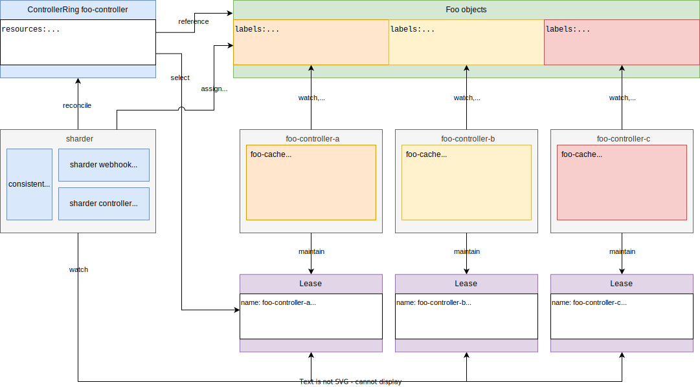

# Kubernetes Controller Sharding

_Horizontally Scalable Kubernetes Controllers_ 🚀

## TL;DR 📖

Make Kubernetes controllers horizontally scalable by distributing reconciliation of API objects across multiple controller instances.
Remove the limitation to have only a single active replica (leader) per controller.

See [Getting Started With Controller Sharding](docs/getting-started.md) for a quick start with this project.

> [!NOTE]
> If you're attending KubeCon EU 2025 in London, swing by for my talk about this project! Find my talk on the [schedule](https://sched.co/1txFG).

## About ℹ️

I started this project as part of my Master's studies in Computer Science at the [DHBW Center for Advanced Studies](https://www.cas.dhbw.de/) (CAS).
I completed a study project ("half-time thesis") on this topic and evolved it in my Master's thesis.

- Download and read the study project (first paper) here: [thesis-controller-sharding](https://github.com/timebertt/thesis-controller-sharding)
- Download and read the Master's thesis (second paper) here: [masters-thesis-controller-sharding](https://github.com/timebertt/masters-thesis-controller-sharding)

This repository contains the implementation belonging to the scientific work: the actual sharding implementation, a sample operator using controller sharding, a monitoring and continuous profiling setup, and some tools for development and evaluation purposes.

## Motivation 💡

Typically, [Kubernetes controllers](https://kubernetes.io/docs/concepts/architecture/controller/) use a leader election mechanism to determine a *single* active controller instance (leader).
When deploying multiple instances of the same controller, there will only be one active instance at any given time, other instances will be on standby.
This is done to prevent multiple controller instances from performing uncoordinated and conflicting actions (reconciliations) on a single object concurrently.

If the current leader goes down and loses leadership (e.g. network failure, rolling update) another instance takes over leadership and becomes the active instance.
Such a setup can be described as an "active-passive HA setup". It minimizes "controller downtime" and facilitates fast fail-overs.
However, it cannot be considered as "horizontal scaling" as work is not distributed among multiple instances.

This restriction imposes scalability limitations for Kubernetes controllers.
I.e., the rate of reconciliations, amount of objects, etc. is limited by the machine size that the active controller runs on and the network bandwidth it can use.
In contrast to usual stateless applications, one cannot increase the throughput of the system by adding more instances (scaling horizontally) but only by using bigger instances (scaling vertically).

## Introduction 🚀

This project allows scaling Kubernetes controllers horizontally by removing the restriction of having only one active replica per controller (allows active-active setups).
It distributes reconciliation of Kubernetes objects across multiple controller instances, while still ensuring that only a single controller instance acts on a single object at any given time.
For this, the project applies proven sharding mechanisms used in distributed databases to Kubernetes controllers.

The project introduces a `sharder` component that implements sharding in a generic way and can be applied to any Kubernetes controller (independent of the used programming language and controller framework).
The `sharder` component is installed into the cluster along with a `ControllerRing` custom resource.
A `ControllerRing` declares a virtual ring of sharded controller instances and specifies API resources that should be distributed across shards in the ring.
It configures sharding on the cluster-scope level (i.e., objects in all namespaces), hence the `ControllerRing` name.

The watch cache is an expensive part of a controller regarding network transfer, CPU (decoding), and memory (local copy of all objects).
When running multiple instances of a controller, the individual instances must thus only watch the subset of objects they are responsible for.
Otherwise, the setup would only multiply the resource consumption.
The sharder assigns objects to instances via the shard label.
Each shard then uses a label selector with its own instance name to watch only the objects that are assigned to it.

Alongside the actual sharding implementation, this project contains a setup for simple [development, testing](docs/development.md), and [evaluation](docs/evaluation.md) of the sharding mechanism.
This includes an example operator that uses controller sharding ([webhosting-operator](webhosting-operator)).
See [Getting Started With Controller Sharding](docs/getting-started.md) for more details.

To support sharding in your Kubernetes controller, only three aspects need to be implemented:

- announce ring membership and shard health: maintain individual shard `Leases` instead of performing leader election on a single `Lease`
- only watch, cache, and reconcile objects assigned to the respective shard: add a shard-specific label selector to watches
- acknowledge object movements during rebalancing: remove the drain and shard label when the drain label is set and stop reconciling the object

See [Implement Sharding in Your Controller](docs/implement-sharding.md) for more information and examples.

## Design 📐

See [Design](docs/design.md) for more details on the sharding architecture and design decisions.

## Discussion 💬

Feel free to contact me on the [Kubernetes Slack](https://kubernetes.slack.com/) ([get an invitation](https://slack.k8s.io/)): [@timebertt](https://kubernetes.slack.com/team/UF8C35Z0D).

Also check out my talk at KubeCon EU 2025 about this project (see the [schedule](https://sched.co/1txFG)).
Reach out on Slack or try to grab me for a chat at the STACKIT booth!
