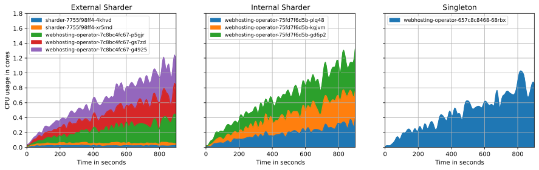
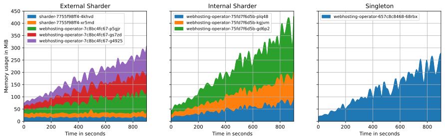

# Evaluating the Sharding Mechanism

This guide describes how the sharding mechanism implemented in this repository is evaluated and outlines the key results of the evaluation performed in the associated [Master's thesis](https://github.com/timebertt/masters-thesis-controller-sharding).
Please refer to the thesis' evaluation section for more details.

## Components

The evaluation setup builds upon the [Development and Testing Setup](development.md) but adds a few more components.
To demonstrate and evaluate the implemented sharding mechanisms using a fully functioning controller, a dedicated example operator was developed: the [webhosting-operator](../webhosting-operator/README.md).
While the webhosting-operator is developed in the same repository, it only serves as an example.

When deploying the sharding components using `make deploy` or `make up`, the webhosting-operator is automatically deployed along with the other evaluation components.
Assuming you're in the repository's root directory, you can deploy the webhosting-operator using:

```bash
# deploy the webhosting-operator using pre-built images
make deploy SKAFFOLD_MODULE=webhosting-operator TAG=latest
# alternatively, build and deploy fresh images
make up SKAFFOLD_MODULE=webhosting-operator
```

To perform a quick test of the webhosting-operator, create some example `Website` objects:

```bash
$ kubectl apply -k webhosting-operator/config/samples
...

$ kubectl -n project-foo get website,deploy,ing,svc,cm -L shard.alpha.sharding.timebertt.dev/webhosting-operator
NAME                                       THEME      PHASE   SINCE   AGE   WEBHOSTING-OPERATOR
website.webhosting.timebertt.dev/kubecon   exciting   Ready   1s      3s    webhosting-operator-5f7854768d-8n59m
website.webhosting.timebertt.dev/library   lame       Ready   1s      3s    webhosting-operator-5f7854768d-j67tj

NAME                             READY   UP-TO-DATE   AVAILABLE   AGE   WEBHOSTING-OPERATOR
deployment.apps/kubecon-b5ed55   1/1     1            1           3s    webhosting-operator-5f7854768d-8n59m
deployment.apps/library-185298   1/1     1            1           3s    webhosting-operator-5f7854768d-j67tj

NAME                                       CLASS   HOSTS                      ADDRESS   PORTS     AGE   WEBHOSTING-OPERATOR
ingress.networking.k8s.io/kubecon-b5ed55   nginx   webhosting.timebertt.dev             80, 443   3s    webhosting-operator-5f7854768d-8n59m
ingress.networking.k8s.io/library-185298   nginx   webhosting.timebertt.dev             80, 443   3s    webhosting-operator-5f7854768d-j67tj

NAME                     TYPE        CLUSTER-IP       EXTERNAL-IP   PORT(S)    AGE   WEBHOSTING-OPERATOR
service/kubecon-b5ed55   ClusterIP   100.82.167.176   <none>        8080/TCP   3s    webhosting-operator-5f7854768d-8n59m
service/library-185298   ClusterIP   100.82.224.52    <none>        8080/TCP   3s    webhosting-operator-5f7854768d-j67tj

NAME                       DATA   AGE   WEBHOSTING-OPERATOR
configmap/kubecon-b5ed55   2      3s    webhosting-operator-5f7854768d-8n59m
configmap/library-185298   2      3s    webhosting-operator-5f7854768d-j67tj
```

You can now visit the created websites at http://localhost:8088/project-foo/homepage and http://localhost:8088/project-foo/official.
You can also visit your [local webhosting dashboard](http://127.0.0.1:3000/d/NbmNpqEnk/webhosting?orgId=1) after forwarding the Grafana port:

```bash
kubectl -n monitoring port-forward svc/grafana 3000
```

This dashboard uses metrics exported by [webhosting-operator](../webhosting-operator/pkg/metrics) about its API objects, i.e., `kube_website_*` and `kube_theme_*`.
There is also a dashboard about the [sharding of websites](http://127.0.0.1:3000/d/7liIybkVk/sharding?orgId=1).

In addition to creating the preconfigured websites, you can also generate some more random websites using the [samples-generator](../webhosting-operator/cmd/samples-generator):

```bash
# create a random number of websites per project namespace (up to 50 each)
$ go run ./webhosting-operator/cmd/samples-generator
created 32 Websites in project "project-foo"
```

## Load Tests

The [experiment](./cmd/experiment) tool allows executing different scenarios for load testing the webhosting-operator, which are used for evaluating the sharding mechanism:

```text
$ go run ./webhosting-operator/cmd/experiment -h
Usage:
  experiment [command]

Available Scenarios
Available Scenarios
  basic       Basic load test, create 9k websites in 15 minutes
  chaos       Create 4.5k websites over 15 minutes and terminate a random shard every 5 minutes
  scale-out   Measure scale-out properties with a high churn rate
...
```

A load test scenario can be executed using one of these commands:

```bash
# run the basic scenario from your development machine (not recommended)
go run ./cmd/experiment basic

# build the experiment image and run the basic scenario as a Job on the cluster
make up SKAFFOLD_MODULE=experiment EXPERIMENT_SCENARIO=basic

# use a pre-built experiment image to run the basic scenario as a Job on the cluster
make deploy SKAFFOLD_MODULE=experiment EXPERIMENT_SCENARIO=basic TAG=latest
```

All scenarios put load on webhosting-operator by creating and mutating a large amount of `Website` objects.
However, creating soo many `Websites` would waste immense compute power just to run thousands of dummy websites.
Hence, webhosting-operator creates `Deployments` of `Websites` in load tests with `spec.replicas=0`.
It also doesn't expose `Websites` created in load tests via `Ingress` objects by setting `spec.ingressClassName=fake`.
Otherwise, this would overload the ingress controller, which is not what the experiment is actually supposed to load test.

When running load test experiments on the cluster, a `ServiceMonitor` is created to instruct prometheus to scrape `experiment`.
As the tool is based on controller-runtime as well, the controller-runtime metrics can be used for visualizing the load test scenario and verifying that the tool is able to generate the desired load.

## Experiment Setup

As a local kind cluster cannot handle such high load, a remote cluster is used to perform the load test experiments.
For this, a [Gardener](https://github.com/gardener/gardener) installation on [STACKIT](https://www.stackit.de/en/) is used to create a cluster based on the [sample manifest](../hack/config/shoot.yaml).
[external-dns](https://github.com/kubernetes-sigs/external-dns) is used for publicly exposing the monitoring and continuous profiling endpoints, as well as `Websites` created outside of load test experiments.

```bash
# gardenctl target --garden ...
kubectl apply -f hack/config/shoot.yaml

# gardenctl target --shoot ...
kubectl apply --server-side -k hack/config/external-dns
kubectl -n external-dns create secret generic google-clouddns-timebertt-dev --from-literal project=$PROJECT_NAME --from-file service-account.json=$SERVICE_ACCOUNT_FILE

# gardenctl target --control-plane
kubectl apply --server-side -k hack/config/policy/controlplane
```

In addition to the described components, [kyverno](https://github.com/kyverno/kyverno) is deployed to the cluster itself (shoot cluster) and to the control plane (seed cluster).
In the cluster itself, kyverno policies are used for scheduling the sharder and webhosting-operator to the dedicated `sharding` worker pool and experiment to the dedicated `experiment` worker pool.
This makes sure that these components run on machines isolated from other system components and don't content for compute resources during load tests.

Furthermore, kyverno policies are added to the control plane to ensure a static size of etcd, kube-apiserver, and kube-controller-manager (requests=limits for guaranteed resources, disable vertical autoscaling, 4 replicas of kube-apiserver and disable horizontal autoscaling).
Also, kube-controller-manager's client-side rate limiting is disabled (ref https://github.com/timebertt/kubernetes-controller-sharding/pull/610, [SIG api-machinery recommendation](https://kubernetes.slack.com/archives/C0EG7JC6T/p1680889646346859?thread_ts=1680791299.631439&cid=C0EG7JC6T)) and HTTP/2 is disabled so that API requests are distributed across API server instances (ref https://github.com/gardener/gardener/issues/8810).
This is done to make load test experiments more stable and their results more reproducible.

## Measurements

After executing a load test experiment, the [measure](../webhosting-operator/cmd/measure) tool is used for retrieving the key metrics from Prometheus.
It takes a configurable set of measurements in the form of Prometheus queries and stores them in CSV-formatted files for further analysis (with numpy/pandas) and visualization (with matplotlib).
Please see the [results directory](https://github.com/timebertt/masters-thesis-controller-sharding/tree/main/results) in the Master's thesis' repository for the exact measurements taken.

The scale of the controller setup is measured in two dimensions:

1. The number of API objects that the controller watches and reconciles.
2. The churn rate of API objects, i.e., the rate of object creations, updates, and deletions.

```yaml
queries:
- name: website-count # dimension 1
  query: |
    sum(kube_website_info)
- name: website-churn # dimension 2
  query: |
    sum(rate(
      controller_runtime_reconcile_total{
        job="experiment", result!="error",
        controller=~"website-(generator|deleter|mutator)"
      }[1m]
    )) by (controller)
```

## SLIs / SLOs

To consider a controller setup as performing adequately, the following SLOs
need to be satisfied:

1. The time of enqueuing object keys for reconciliation for every controller, measured as the 99th percentile per cluster-day, is at maximum 1 second.
2. The latency of realizing the desired state of objects for every controller, excluding reconciliation time of controlled objects, until observed by a watch request, measured as the 99th percentile per cluster-day, is at maximum x, where x depends on the controller.

In case of the `Website` controller, 5 is chosen for x.

```yaml
queries:
- name: latency-queue # SLO 1
  type: instant
  slo: 1
  query: |
    histogram_quantile(0.99, sum by (le) (rate(
      workqueue_queue_duration_seconds_bucket{
        job="webhosting-operator", name="website"
      }[$__range]
    )))
- name: latency-reconciliation # SLO 2
  type: instant
  slo: 5
  query: |
    histogram_quantile(0.99, sum by (le) (rate(
      experiment_website_reconciliation_duration_seconds_bucket{
        job="experiment"
      }[$__range]
    )))
```

## Comparison

The following graphs show the generated load and compare the resulting CPU, memory, and network usage of the components in three different setups when running the `basic` experiment scenario (~9k websites created over 15m):

- external sharder: 3 webhosting-operator pods (shards) + 2 sharder pods (the new approach implemented in this repository, second iteration for the Master's thesis)
- internal sharder: 3 webhosting-operator pods (3 shards, 1 acts as the sharder) (the old approach, first iteration for the study project)
- singleton: 1 webhosting-operator pod (traditional leader election setup without sharding)







The new external sharding approach proves to scale best.
The individual shards consume about a third of the singleton controller's usage (close to optimum).
Also, the sharder pods consume a low static amount of resources. 
Most importantly, the sharder's resource usage is independent of the number of sharded objects.

## Horizontal Scalability

To evaluate the horizontal scalability of the sharding mechanism (external sharder), the maximum load capacity is determined for different numbers of instances (1, 2, 3, 4, 5).
While the load increases, cumulative SLIs from the start of the experiment are calculated.
When the cumulative SLI grows above the SLO, the current count and churn rate are the maximum load capacity.
As shown in the last plot, the system's capacity increases almost linearly with the number of added instances.


